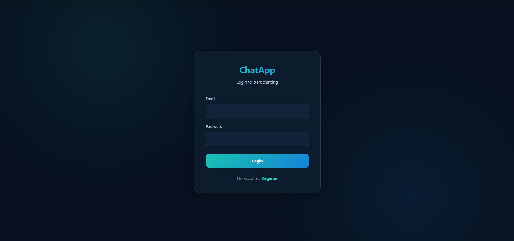
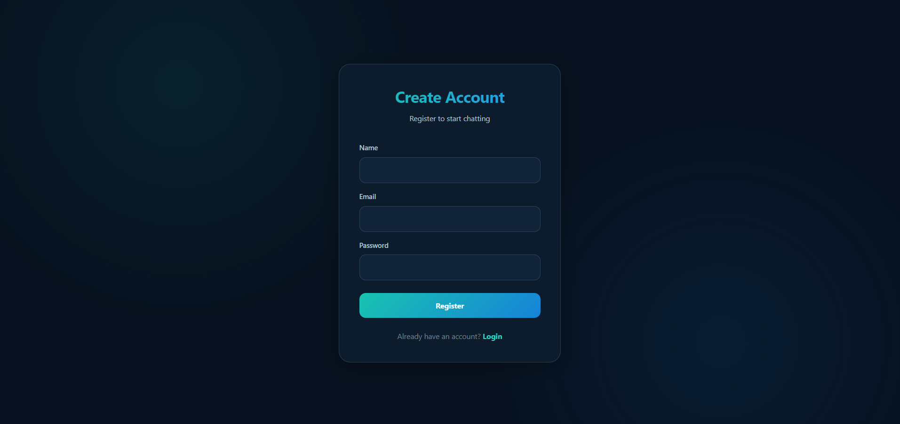
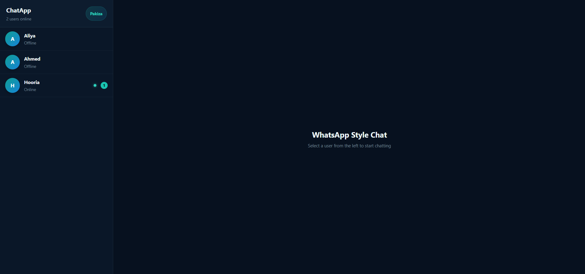
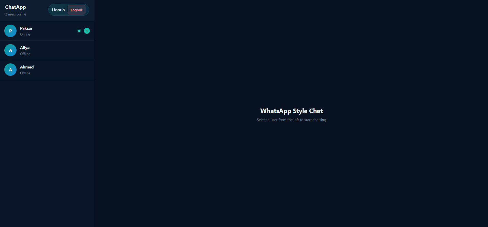

<div align="center">


<br>

# CHAT APP

### Connect Instantly. Chat in Real Time.

<p>
  <strong>A modern one-to-one real-time chat application built with the MERN stack and Socket.IO.</strong>
</p>

<br>


<br><br>


</div>

---

## 📖 About

**ChatApp** is a full-stack real-time messaging application developed using the **MERN stack**.

The application allows users to register and log in, view available users, check online status, start one-to-one conversations, send messages instantly, and maintain chat history.

The project focuses on practical implementation of **React, Node.js, Express, MongoDB, Redux Toolkit, authentication, REST APIs, and real-time communication with Socket.IO**.

---

## ✨ Features

<table>
<tr>

<td width="33%" valign="top">

### 🔐 Authentication

* User registration
* User login
* Logout
* Authentication state
* Protected chat experience

</td>

<td width="33%" valign="top">

### 💬 Real-Time Chat

* One-to-one conversations
* Instant messaging
* Chat history
* Message timestamps
* Sender & receiver messages

</td>

<td width="33%" valign="top">

### 🟢 Online Presence

* Online/offline status
* Online user count
* Live presence updates
* Real-time user tracking

</td>

</tr>

<tr>

<td width="33%" valign="top">

### 👥 Users

* Registered users list
* User selection
* User avatars
* Active conversation
* Unread message badges

</td>

<td width="33%" valign="top">

### 🔔 Message Status

* Read indicators
* Delivery indicators
* Unread message count
* Live message updates

</td>

<td width="33%" valign="top">

### 🎨 Interface

* Modern dark interface
* Clean chat layout
* Sidebar user list
* Message bubbles
* Responsive design

</td>

</tr>

<tr>

<td width="33%" valign="top">

### ⚡ Real-Time System

* Socket.IO communication
* Instant message delivery
* Live status updates
* Real-time unread updates

</td>

<td width="33%" valign="top">

### 💾 Data

* User records
* Chat messages
* Conversation history
* Message timestamps

</td>

<td width="33%" valign="top">

### 📱 Responsive

* Desktop support
* Tablet support
* Mobile-friendly layout
* Adaptive chat interface

</td>

</tr>
</table>

---

## 🛠️ Technology Stack

<p align="center">


</p>

---

## 🖥️ Screenshots

### 🔑 Login Screen

<p align="center">
  
</p>

### 📝 Registration Screen

<p align="center">
  
</p>

### 💬 Default Chat Screen

<p align="center">
  
</p>

### 💭 Chat Conversation

<p align="center">
  
</p>

### 🔔 Unread Message Indication

<p align="center">
  
</p>

---

## 🚀 Setup Guide

### System Requirements

| Requirement | Details |
| :--- | :--- |
| **Operating System** | Windows / macOS / Linux |
| **Frontend** | React.js |
| **Backend** | Node.js + Express.js |
| **Database** | MongoDB |
| **Runtime** | Node.js |
| **Package Manager** | npm |

### Installation

#### 1. Clone the Repository

```bash
git clone https://github.com/YOUR-USERNAME/YOUR-REPOSITORY.git
cd ChatApp
```

#### 2. Install Frontend Dependencies

```bash
cd client
npm install
```

#### 3. Install Backend Dependencies

```bash
cd ../server
npm install
```

#### 4. Start the Backend

```bash
cd server
npm run dev
```

Or:

```bash
node server.js
```

#### 5. Start the Frontend

Open another terminal:

```bash
cd client
npm run dev
```

Open the local development URL provided by Vite.

---

## 🧪 Testing

To test the real-time messaging functionality:

1. Register a user.
2. Log in to the application.
3. Open another browser or incognito window.
4. Register a second user.
5. Log in with the second account.
6. Select each user from the chat list.
7. Send messages between both accounts.
8. Verify that messages appear in real time.
9. Test online/offline status.
10. Test unread message indicators.

Using two browser sessions allows the real-time communication features to be tested locally.

---

## 🧠 Concepts Used

<table>
<tr>

<td width="50%" valign="top">

### Frontend Concepts

* React Components
* React Router
* Redux Toolkit
* State Management
* Axios API Requests
* Responsive UI
* Event Handling

</td>

<td width="50%" valign="top">

### Backend Concepts

* Node.js
* Express.js
* REST APIs
* MongoDB
* Mongoose
* Authentication
* Socket.IO
* Real-Time Communication

</td>

</tr>
</table>

---

## 🔮 Future Improvements

* ⌨️ Typing indicators
* ✏️ Message editing
* 🗑️ Message deletion
* 📎 Image & file sharing
* 😀 Emoji support
* 🔎 Conversation search
* 🕐 Last seen status
* 🔔 Push notifications
* 👥 Group conversations
* 🖼️ Profile pictures
* 📱 Improved mobile navigation
* ☁️ Production deployment

---

<div align="center">

## 💬 Connect Instantly. Chat in Real Time.

<strong>ChatApp — React · Node.js · Express · MongoDB · Socket.IO</strong>

<br><br>


</div>
